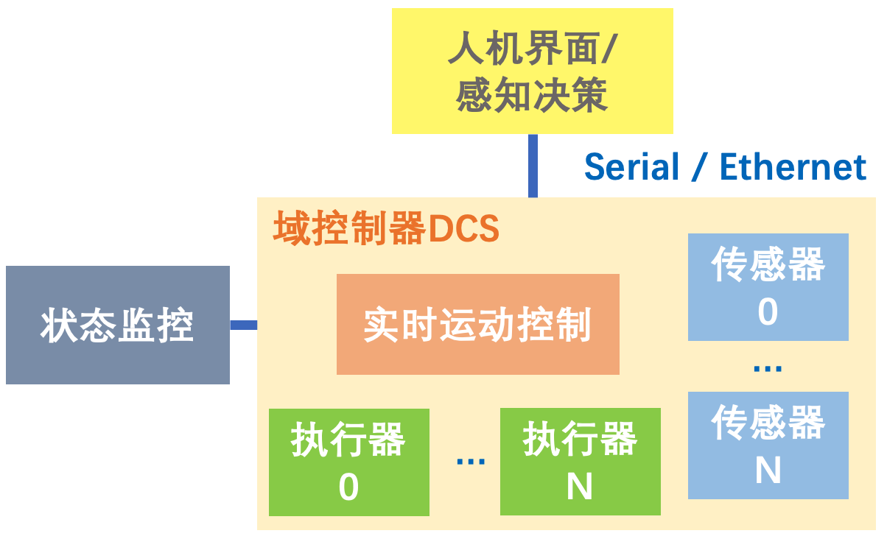

# CAN-Duck: A Distributed MICROcontroller Communication stacK based on CAN   -- 基于CAN总线的分布式微控制器通信协议栈


## 1. 什么是CAN-Duck？

### 1.1 微控制器通信典型场景

机器人、消费电子、工业控制领域中，经常需要将系统功能分散在多个MCU中实现，以满足电气连接的约束，或提升系统的模块化程度。以下是一个典型的机器人产品MCU连接图：


一般将要求硬实时的运动控制算法运行在一个MCU中，采用bare metal架构（无操作系统），并用CAN总线等和执行器进行通信；执行器的MCU接收运动控制指令，并运行伺服驱动程序（如FOC、三闭环）。而对算力需求更高的人机界面、感知决策算法运行在通用处理器中，采用Linux/Windows等通用操作系统。这样也能节省采购RTOS的成本并对系统进行快速验证。

另一方面，对于某些对成本约束极严的产品，常会将高度优化后的伺服驱动程序和实时运动控制、甚至传感器采集程序都全部集中在一块MCU中，这一MCU此时被称为**域控制器（DCS）**，此时系统架构如下：



一般来讲，采用分布式架构还是DCS架构，取决于产品开发的阶段。早期验证时，为了加快迭代速度，一般采用分布式架构，直接集成硬件模块；后期产品功能明确后，为了降低成本，可能会换为DCS架构。

### 1.2 为什么需要通信协议栈？
CAN、串口的底层原理都非常简单，但面对复杂的业务需求，如：需要在有限的MTU约束下传输多种不同功能的数据包；对远程MCU的内部数据进行可靠的访问；对不同功能、不同总线上的MCU采用统一的API进行控制等，就不能直接利用通信硬件的底层数据直接满足这些需求，而必须对数据传输的链路层、协议层、表示层进行抽象和封装。
CAN总线常采用的协议栈是CANOpen，这一协议栈已在工业领域广泛应用；串口一般采用ModBus协议或AT指令等。另外还有UAVCAN等业余爱好者开发的协议。

### 1.3 CAN-Duck vs CAN-Open

既然已经有了CANOpen，我们为什么仍要开发CAN-Duck？CAN-Duck具有以下几方面的优势。

1. **开发语言**：CAN-Duck一开始就采用C++11开发，结合接口描述语言IDL和C++模板带来的编译期类型检查能力，使得对象字典可被方便和安全地访问。相比之下CANOpen的几个开源协议栈（CANOpenNode、Lely CAN）等较为保守地采用C语言作为原始的内核，在使用上较为复杂。
2. 实时数据：CANOpen的应用场景是具有大量状态量的工业系统，因此采用字典映射的方式压缩Index以有效传输实时数据，但这也带来了额外复杂度。CAN-Duck针对现代机器人和消费电子等领域进行优化，以最低的学习验证成本实现了实时数据传输。且CAN-Duck充分利用了CAN2.0的29位扩展ID，使得单包实时数据的MTU支持到了10字节，降低了分段传输的额外开销。
3. **Pub/Sub模式的支持**：CAN-Duck直接提供封装好的发布者-订阅者API，接口简洁明了，无需为了传输实时数据而重新学习CANOpen的PDO格式。
4. **C/S模式的支持**：对于可靠地访问远程节点的内部状态，CANOpen仅在协议层定义了SDO数据格式，至于上层API则需要用户自行实现。因C/S模式需要比实时数据更复杂的数据解析，且要实现异步API，因此比Pub/Sub更为复杂。CAN-Duck不仅支持C/S模式，且实现了一个基于事件循环的客户端请求管理器，大大简化了客户端的编程工作。事件循环可在无操作系统的MCU中直接运行。
5. **多总线统一接口**：CAN-Duck虽然基于CAN总线，但也实现了一个基于字节设备的较为完善的CAN模拟，因此可以使得串口、UDP网口等无缝转发CAN的数据包。因此CAN-Duck可以很好地在小至Arduino，大至带CAN-Ethernet网关的复杂网络中工作。
6. **单MCU虚拟多节点的能力**：
7. **集成文件传输协议**：实现了一个简单的文件传输协议


## 1. 特性

- **适用于微控制器的实时消息中间件 ：** 赋能消费电子、机器人、工控领域，产品级、快速、可靠的原型开发。

- **兼容性：**
    - 跨总线：支持共享内存、CAN、UART、RS485、以太网等，可无缝、无感地衔接不同种类通信方式。
    - 跨平台：一套代码可支持STM32裸机，Windows，Linux，MacOSX
    
- **分布式：** 网络拓扑为多主（Multi-Master）软总线，无需中心节点，便于更改网络结构。
- **发布者-订阅者 Publisher-Subscriber：** 多对多实时消息收发。
- **参数服务器 Parameter Server：** 可靠的同步/异步参数读写服务。
- **远程过程调用 RPC：** 可靠的同步/异步请求发送和应答响应。
- **远程固件升级 OTA Update：** 可对任意一个或多个节点进行可靠的固件下载。
- **接口定义语言 IDL：** 面向用户的消息API由脚本自动生成，用户只需定义消息名称和类型。可快速适配新需求。
- **节点映射 Context Mapping：** 同一个MCU上可以有多个通信节点，每个节点均可像在一个独立的MCU
上一样工作：每个节点拥有独立的地址，可通过本地或网络上任一其它节点直接访问。这使得硬件架构的变化变得简单：比如，不论某传感器/执行器位于哪个MCU
，均可以以相同的方式访问它。而同一MCU上多节点之间采用共享内存通信，和使用全局变量直接传递数据效率相同，在需要无延迟的高性能控制场景也适用。
- **超轻量：** 可直接运行于无RTOS的STM32，占用不到10kROM，无需中断请求。消息收发及调度额外开销几乎为零，效率接近直接面向寄存器开发。
- **丰富的调试工具：** 
    - **FCNProbe：** 总线调试器。硬件+上位机，将高帧率的数据包和串口Log进行汇总、转发、记录、回放。上位机Windows，Linux
    ，MacOSX
    全平台兼容。
    - **FCNVis:：** 实时数据可视化上位机。Windows，Linux，MacOSX全平台兼容。
    - **Tracer：** MCU/上位机通用的轻量C
    ++调试信息打印库，可自定义过滤等级、输出目标，在终端中彩色显示。内置缓冲区，因此打印API的调用为并发、非阻塞式的，且在MCU
    中已配置为使用DMA进行串口输出。因此即便在Debug版本输出较多的调试信息，程序行为和Release版本也几乎无差异。

--------------

## 2. 克隆仓库并运行第一个测试
### 2.1 前置需求

- Windows
  - Windows 10
  - CLion 2020 (可选)
  - STM32CubeIDE
  - Visual Studio 2019 Community  
  - Git / vckpg / CMake / doxygen(1.8.15+) / Python3
  - GTest (从vckpg安装)
  - FT232 VCom Driver  
  <br>
*提示：您可能需要将Windows的系统编码格式改为UTF-8以消除编译错误*
  <br>
- Linux & MacOSX
  - CLion 2020  (可选)
  - STM32CubeIDE
  - Git / vckpg / CMake / doxygen(1.8.15+) / Python3
  - GTest

### 2.2 通过命令行编译运行测试用例

### 2.2 在CLion IDE中运行测试用例


--------------
## 3. 使用入门
### 3.1 启动节点并添加网络设备

### 3.2 发布者-订阅者
**定义消息**

**发布消息**

**订阅消息**

### 3.3 参数服务器
**定义消息**

**服务器**

**客户端**


```c

/**
*                      (Host/Monitor)
*                          |
*                  [ Serial/Ethernet ]
*                          |
*  (subnet A) ----{[CAN1]-[DCS]-[CAN2]}------(subnet B)
*
* */


//fast msg ext (29 bit CAN ID)
//is seg   1 bit        [ =0]   
//is msg   1 bit        [ =1]
//node id  6 bit        [1-63 & 0]
//tx/rx    1 bit        [0/1]
//msg  id  3 bit        [0-7] 
//empty n  1 bit        [0/1]
//data[0]                           
//data[1]
//data 2-9


//sevice (29 bit CAN ID)
//is seg  1  bit        [ =0]     
//is msg  1  bit        [ =0]
//src id  6  bit        [ 1-63 & 0(anou) ]
//dest id 6  bit        [ 1-63 & 0(anou) ]
//op code 5  bit        [ 0-31   ]   
//srv_id  10 bit        [ 0-1023 ]


//fast msg std (11 bit CAN ID)  (TODO..)
//is seg                [0/1]  (if data follow uart's protocol)
//node id  6 bit        [1-63 & 0(anou)]
//tx/rx    1            [0/1]               
//msg  id  3 bit    tx: [0-7]  + (offset=8)  
//data 0-7

//segmented msg (29 bit CAN ID)   (TODO..)
//is seg     1 bit      [ =1]   
//src id     6 bit      [ 1-63 & 0(anou) ]
//dest id    6 bit      [ 1-63 & 0(anou) ]
//trans id   6 bit                       
//s/t/e      2 bit      [0/1/2]
//data[0]    : pack_n/pack_c(down count)
//data[1-8]  : merged:{srv_id/srv_op+srv_code, data}


```


详细文档见[这里](docs/doxygen/html/index.html) 