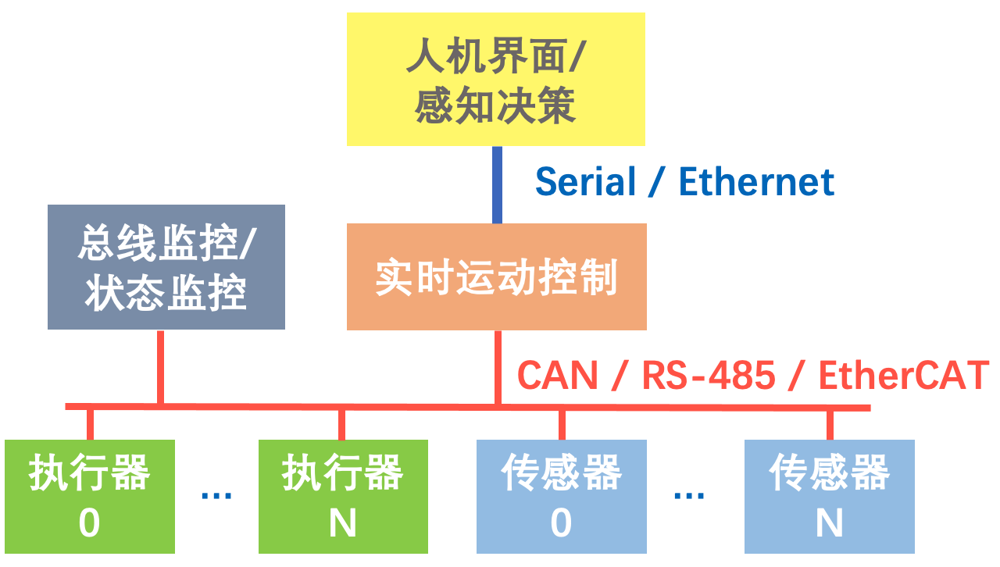

# CAN-Duck: A Distributed MICROcontroller Communication stacK Based on CAN 

**小黄鸭-基于CAN总线的分布式微控制器通信协议栈**


---------------

- [CAN-Duck: A Distributed MICROcontroller Communication stacK Based on CAN](#can-duck-a-distributed-microcontroller-communication-stack-based-on-can)
  - [1. 初步接触CAN-Duck](#1-初步接触can-duck)
    - [1.1 前置需求](#11-前置需求)
    - [1.2 克隆仓库并运行第一个测试](#12-克隆仓库并运行第一个测试)
    - [1.3 在STM32上测试](#13-在stm32上测试)
  - [2. 什么是CAN-Duck？](#2-什么是can-duck)
    - [2.1 微控制器通信典型场景](#21-微控制器通信典型场景)
    - [2.2 为什么需要通信协议栈？](#22-为什么需要通信协议栈)
    - [2.3 CAN-Duck vs CANOpen](#23-can-duck-vs-canopen)
  - [3. 使用指南](#3-使用指南)
    - [3.1 启动节点并添加网络设备](#31-启动节点并添加网络设备)
    - [3.2 发布者-订阅者](#32-发布者-订阅者)
    - [3.3 参数服务器](#33-参数服务器)
    - [3.4 编写自己的消息定义](#34-编写自己的消息定义)
  - [4. 数据帧结构](#4-数据帧结构)

---------------


## 1. 初步接触CAN-Duck
### 1.1 前置需求  
**硬件：**  要运行网络数收发测试，你需要一对USB转串口线，并将TX、RX交叉连接。如果没有串口线，可以运行虚拟节点通信测试。   
**软件：**  我们采用vcpkg作为三方库的包管理器。依赖的包为gtest。安装命令```vckpg install gtest```。

### 1.2 克隆仓库并运行第一个测试
```bash
git clone <repo_dir>  --recursive
cd repo_dir 
mkdir build && cd build
cmake -DCMAKE_TOOLCHAIN_FILE=<path_to_vcpkg>/scripts/buildsystems/vcpkg.cmake ..
make ..

#运行第一个测试
./bin/testNode --gtest_filter="PubSub"
```

### 1.3 在STM32上测试
请移步[CAN-Duck例程页面]()。

---------------


## 2. 什么是CAN-Duck？

### 2.1 微控制器通信典型场景
机器人、消费电子、工业控制领域中，经常需要将系统功能分散在多个MCU中实现，以满足电气连接的约束，或提升系统的模块化程度。以下是一个典型的机器人产品MCU连接图：



一般将要求硬实时的运动控制算法运行在一个MCU中，采用bare metal架构（无操作系统），并用CAN总线等和执行器进行通信；执行器的MCU接收运动控制指令，并运行伺服驱动程序（如FOC、三闭环）。而对算力需求更高的人机界面、感知决策算法运行在通用处理器中，采用Linux/Windows等通用操作系统。这样也能节省采购RTOS的成本并对系统进行快速验证。
    
另一方面，对于某些对成本约束极严的产品，常会将高度优化后的伺服驱动程序和实时运动控制、甚至传感器采集程序都全部集中在一块MCU中，这一MCU此时被称为**域控制器（DCU）**，此时系统架构如下：


一般来讲，采用分布式架构还是DCU架构，取决于产品开发的阶段。早期验证时，为了加快迭代速度，一般采用分布式架构，直接集成硬件模块；后期产品功能明确后，为了降低成本，可能会换为DCU架构。

### 2.2 为什么需要通信协议栈？

CAN、串口的底层原理都非常简单，但面对复杂的业务需求，如：需要在有限的MTU约束下传输多种不同功能的数据包；对远程MCU的内部数据进行可靠的访问；对不同功能、不同总线上的MCU采用统一的API进行控制等，就不能直接利用通信硬件的底层数据直接满足这些需求，而必须对数据传输的链路层、协议层、表示层进行抽象和封装。
CAN总线常采用的协议栈是CANOpen，这一协议栈已在工业领域广泛应用；串口一般采用ModBus协议或AT指令等。另外还有UAVCAN等业余爱好者开发的协议。

### 2.3 CAN-Duck vs CANOpen

既然已经有了CANOpen，我们为什么仍要开发CAN-Duck？CAN-Duck具有以下几方面的优势。

- **开发语言：**  
    CAN-Duck一开始就采用**C++11**开发，结合**接口描述语言**IDL和C++模板带来的**编译期类型检查**能力，使得对象字典可被方便和安全地访问。相比之下CANOpen的几个开源协议栈（CANOpenNode、Lely CAN）等较为保守地采用C语言作为原始的内核，在使用上较为复杂。且得益于C++标准库的**跨平台**能力，CAN-Duck协议栈可一套代码同时运行在MCU、Linux、Windows、Mac上。

- **实时数据：**   
    CANOpen的应用场景是具有大量状态量的工业系统，因此采用字典映射的方式压缩Index以有效传输实时数据，但这也带来了额外复杂度。CAN-Duck的数据包针对现代机器人和消费电子等领域进行优化，以最低的学习验证成本实现了实时数据传输。且CAN-Duck充分利用了CAN2.0的29位扩展ID，使得单包实时数据的MTU支持到了**10字节**，降低了分段传输的额外开销。

- **Pub/Sub模式的支持：**   
    CAN-Duck直接提供封装好的**发布者-订阅者API**，接口简洁明了，无需为了传输实时数据而重新学习CANOpen的PDO格式。

- **C/S模式的支持：**  
    对于可靠地访问远程节点的内部状态，CANOpen仅在协议层定义了SDO数据格式，至于上层API则需要用户自行实现。因C/S模式需要比实时数据更复杂的数据解析，且要实现异步API，因此比Pub/Sub更为复杂。CAN-Duck不仅支持C/S模式，且实现了一个基于事件循环的客户端请求管理器、并将发起请求的接口和对象字典进行了**很好的融合**，大大简化了客户端的编程工作。上述事件循环可在无操作系统的MCU中直接运行。


- **多总线统一接口：**  
    CAN-Duck虽然基于CAN总线，但也实现了一个基于字节设备的较为完善的**CAN数据包模拟**，因此可以使得串口、UDP网口等无缝转发CAN的数据包。得益于此，CAN-Duck可以很好地在小至Arduino，大至带CAN-Ethernet网关的复杂网络中工作。你甚至不需要CAN转换器即可使用完整的CAN-Duck协议栈。

- **单MCU虚拟多节点的能力：**  
    这是CAN-Duck比CANOpen更灵活的另一创新点：在传统的CAN通信中，如果分布式架构中某一MCU的功能要集成在DCU中，则上位机、DCU中所有涉及该MCU通信相关的代码均需要做出更改，这减慢了研发的进度。在CAN-Duck中，一个MCU可以虚拟多个节点，每个节点均具有CAN-Duck协议栈的**完整功能**，可对同一MCU上的其它虚拟节点或另一MCU上的远程节点进行通信，而API是完全统一的。对于同一MCU上的虚拟节点，实时数据的传输采用了共享内存的方式，效率和直接使用全局变量传递数据是相同的。

- **集成文件传输协议：**   
    CAN-Duck实现了一个简单的文件传输协议，可用于OTA、记录读取等。该文件传输协议的服务端和客户端也均可在无OS的MCU中直接运行。  

- **丰富的调试工具：**   
    CAN-Duck已经集成了多种方便的调试工具：  
	- **DuckProbe：** 总线调试器。硬件+上位机，将高帧率的数据包和串口Log进行汇总、转发、记录、回放。上位机Windows，Linux ，MacOSX全平台兼容。  
	- **WaveLight：** 实时数据可视化上位机。Windows，Linux，MacOSX全平台兼容。  
	- **Tracer：** MCU/上位机通用的轻量C++调试信息打印库，可自定义过滤等级、输出目标，在终端中彩色显示。内置缓冲区，因此打印API的调用为并发、非阻塞式的，且在MCU中已配置为使用DMA进行串口输出。因此即便在Debug版本输出较多的调试信息，程序行为和Release版本也几乎无差异。  

- **和UAVCAN的比较：**  
  UAVCAN是一个优秀的CAN通讯库，但和CAN-Duck相比，其API更加复杂，且实时消息的额外开销更大。号称更完善的UAVCAN 2.0并无明确的发布时间点，且稳定性未知。

--------------

## 3. 使用指南
### 3.1 启动节点并添加网络设备
```cpp
#include "can_duck/Context.hpp"
int main(){
    can_duck::Context ctx(&can);    /* 创建上下文管理器 */
    ...
}
```
can_duck::Context是用来管理本地CAN设备和虚拟节点的对象，发布订阅和参数服务都由它管理。

### 3.2 发布者-订阅者
**发布消息**  
我们假设这是一个伺服，希望发布自己的角度信息
```cpp
#include "ServoDict.hpp"
#include "can_duck/Context.hpp"

using namespace duckmsg; /* 数据元信息的命名空间 */

int main(){
    can_duck::Context ctx(&can);    /* 创建上下文管理器 */
    can_duck::Publisher*  servo_pub;/* 声明发布者 */
    can_duck::Subscriber* servo_sub;/* 声明订阅者 */

    std::tie(servo_pub, servo_sub) =
            ctx.msg().bindChannel(  /* 同时创建发布者和订阅者 */
                ServoMsgTx,     /* 发送数据元信息 */
                ServoMsgRx,     /* 接收数据元信息 */
                SERVO_ADDR,     /* 自身地址 */
                true);          /* 表明该地址是自身的，而非远程的 */
    while(1){
        servo_pub->publish(
            ServoMsgTx.angle(32767) /* 可原子性地创建元信息副本并同时赋值 */
        );

        sleep(1);
    }
}
```
**订阅消息**

我们假设上述伺服希望订阅任何节点发送给自己的目标角度指令，只需在循环中直接读取订阅者的缓存数据。

```cpp
...
uint16_t target_angle;      
DICT_T(ServoMsgRx.target_angle) target_angle_auto_type; /* 也可采用自动类型 */
servo_sub->readBuffer(ServoMsgRx.target_angle) >> target_angle;  /* 读取角度 */
...
```

如果我们希望在收到角度指令后被通知，可注册一回调函数进行订阅。
```cpp
/* 定义一个回调函数 */
DUCK_SUBSCRIBE_CALLBACK(on_target_angle) {
    uint16_t target_angle; 
    subscriber->readBuffer(ServoMsgRx.target_angle) >> target_angle;
}
...
int main(){
    ...
    /* 向订阅者注册回调函数 */
    servo_sub->subscribe(ServoMsgRx.target_angle, on_target_angle);
    ...
}
```

### 3.3 参数服务器
**服务器**
我们假设该伺服，希望暴露一个模式设置接口，可由外界读写

```cpp
#include "ServoDict.hpp"
#include "can_duck/Context.hpp"

using namespace duckmsg; /* 数据元信息的命名空间 */

int main(){
    can_duck::Context ctx(&can);    /* 创建上下文管理器 */
    auto server = ctx.srv().makeServer(  /* 创建服务器 */
                ServoSrv,         /* 服务 */
                SERVO_ADDR);      /* 自身地址 */

    server->setWrAccess(ServoSrv.mode); /* 启用写权限（读权限默认开启） */
                       
    while(1){
        ...
    }
}
```

**客户端**
```cpp
/* 定义一个回调函数 */
DUCK_REQUEST_CALLBACK(mode_wr_callback){
    /* 根据事件码判断成功/拒绝/超时 */
    switch(ev_code){
        case 0 : LOGE("Write angle REJECTED!!"); break; /*无权限拒绝写入*/
        case 1 : LOGW("Write angle SUCCESS!"); break;   /*写入成功*/
        case 2 : LOGE("Write angle TIMEOUT.."); break;    /*通信超时*/
        default: break;
    }
}

int main(){
    ...
    auto servo_client = bindServer(ServoSrv, SERVO_ADDR, CLIENT_ADDR);

    
    servo_client->writeAsync(
        ServoSrv.mode(1), /* 可原子性地创建元信息副本并同时赋值 */
        angle_rd_callback /* 异步写需要注册回调函数 */
        );
}
```

### 3.4 编写自己的消息定义

编写IDL文件（yaml格式）：
```yaml
# ServoDict.yaml

node: Servo
    msg_tx:
        angle: uint16_t
    msg_rx:
        target_angle: uint16_t 
    srv:
        mode: uint8_t
```
运行元信息生成脚本
```bash
duckgen ServoDict.yaml 
```

## 4. 数据帧结构

```c
/*
* 基于29位扩展ID的快实时消息包头
* */
struct HeaderFastMsgExt {
    uint32_t reserve : 3;   /* =0 */
    uint32_t is_seg  : 1;   /* =0 */
    uint32_t is_msg  : 1;   /* =1 */
    uint32_t node_id : 6;
    uint32_t is_tx   : 1;
    uint32_t msg_id  : 3;
    uint32_t is_d1_empty : 1;
    uint32_t data_0  : 8;
    uint32_t data_1  : 8;
};

/*
    * 基于11位扩展ID的快实时消息包头
    * */
struct HeaderFastMsgStd {
    uint32_t reserve : 21;  /* =0 */
    uint32_t is_seg  : 1;   /* =0 */
    uint32_t is_msg  : 1;   /* =1 */
    uint32_t node_id : 6;
    uint32_t is_tx   : 1;
    uint32_t msg_id  : 3;
};


struct HeaderService{
    uint32_t reserve : 3;   /* =0 */
    uint32_t is_seg  : 1;   /* =0 */
    uint32_t is_msg  : 1;   /* =0 */
    uint32_t src_id  : 6;
    uint32_t dest_id : 6;
    uint32_t op_code : 5;
    uint32_t service_id : 10;
};

struct HeaderSegment{
    uint32_t reserve : 3;   /* =0 */
    uint32_t is_seg  : 1;   /* =1 */
    uint32_t src_id  : 6;
    uint32_t dest_id : 6;
    uint32_t trans_id: 6;
    uint32_t status  : 2;
    uint32_t data_0  : 8;
};
```


详细文档见[这里](docs/doxygen/html/index.html) 